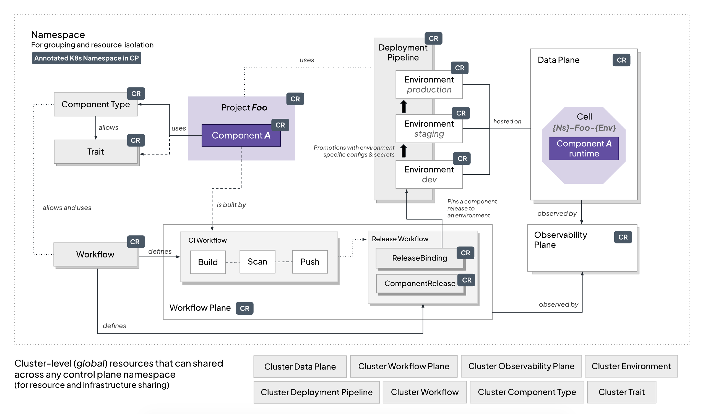

  

  

    
  

  <h1 style="font-size: 1.5em;">
    A complete, open-source developer platform for Kubernetes
  </h1>
  
OpenChoreo is a developer platform for Kubernetes offering development and architecture abstractions, a Backstage-powered developer portal, application CI/CD, GitOps, and observability.

<!-- License & Community -->

<!-- Security & Compliance -->

<!-- Build, Quality & Project Info -->

## Why OpenChoreo?
Kubernetes gives you powerful primitives like Namespaces, Deployments, CronJobs, Services, and NetworkPolicies, but they're too low-level for most developers. Platform engineers end up building the actual platform from scratch: defining higher-level abstractions, wiring together tools for delivery, security and observability, and maintaining all of it as an in-house product.

That means stitching together a developer portal, CI pipelines, GitOps workflows, an observability stack, and access controls and then owning the glue between them indefinitely. The result is a fragile, bespoke system that's expensive to maintain and hard to evolve.

Developers and platform engineers need different things from the same platform. Developers want a simple, self-service experience. Platform engineers want control over what's running underneath. Most DIY platforms end up optimizing for one side at the expense of the other.

## What is OpenChoreo?
OpenChoreo, now a CNCF Sandbox project, takes a different approach. Instead of giving you a toolkit to assemble your own platform, it provides a complete, open-source developer platform for Kubernetes with abstractions that translate developer intent into platform reality. So platform engineers don't have to reinvent the wheel, and developers get a self-service experience that stays out of their way.

Under the hood, OpenChoreo brings together a Backstage-powered developer portal, built-in CI and GitOps, observability, RBAC, and analytics and all of them are organized across dedicated control, CI, data, and observability planes. Platform engineers get a production-ready foundation they can operate and extend, not scaffolding they'll eventually replace.

OpenChoreo was originally developed by [WSO2](https://wso2.com), based on its experience building the SaaS internal developer platform formerly known as WSO2 Choreo (now WSO2 Developer Platform), bringing its core ideas to the open-source community. It's not a fork or an open-source dump; it's a complete rewrite based on what we learned from Choreo’s users over the years.

## How does OpenChoreo work?
OpenChoreo is built around a multi-plane architecture, where each plane handles a distinct concern and operates independently.

  

 

- The **Experience Plane** is where developers, platform engineers, and SREs interact with the platform via a Backstage-powered OpenChoreo Portal, CLI, GitOps, or AI agents.

- The **Control Plane** sits at the center of OpenChoreo. It takes developer intent and platform intent expressed through high-level abstractions like components, endpoints, dependencies, environments, pipelines, and namespaces and translates them into the underlying Kubernetes resources. It also reflects runtime reality back up, so what developers see always matches what's actually running.

- The **Data Plane** is where your workloads run. It is where OpenChoreo enforces and guarantees the semantics of those high-level abstractions, such as isolation between projects, traffic policies, and security boundaries. These aren't just configurations; they're guaranteed by the platform.

- The **Observability Plane** feeds the loop with metrics, logs, and tracing, all surfaced through the abstractions your developers already understand.

- The optional **CI Plane** handles builds using cloud native Buildpacks and Argo Workflows by default.

At the center of this is a set of opinionated abstractions. Developers work with components (services, workers, cron jobs, and other types defined as component types), expose functionality through endpoints, and declare dependencies on other endpoints or resources. Platform engineers control what component types are available, what traits can be applied, and how workloads behave, through configuration, not custom code.

The result is a clear separation of concerns: developers express what they want to run, the control plane figures out how to run it, and platform engineers govern the boundaries.

Underpinning all of this is the Platform API. It is a set of Kubernetes CRDs that let platform engineers declaratively define the structure and behavior of the entire platform. Instead of writing custom controllers or glue scripts, you configure organizational boundaries, environments, data planes, deployment pipelines, and observability through familiar Kubernetes-native resources. The Platform API also includes programmable abstractions like ComponentTypes, Traits, and Workflows that let platform teams define golden paths for their developers, encapsulate best practices, and enforce organizational standards. Together, they enable OpenChoreo's approach to policy, security, and governance by design.

The diagram below illustrates some of the core concepts of the Platform API and how they relate to each other. It represents one possible platform topology, not a prescribed structure.

  

 

## Getting Started

The easiest way to try OpenChoreo is by following the **[Quick Start Guide](https://openchoreo.dev/docs/getting-started/quick-start-guide/)**. It walks you through setting up Choreo using a Dev Container, so you can start experimenting without affecting your local environment.

For a deeper understanding of OpenChoreo's architecture, see **[OpenChoreo Concepts](https://openchoreo.dev/docs/category/concepts/)**.

Visit **[Installation Guide](https://openchoreo.dev/docs/getting-started/try-it-out/on-k3d-locally/)** to learn more about installation methods.

## Samples

Explore hands-on examples to help you configure and deploy your applications using OpenChoreo.

- **[Platform Configuration](./samples/platform-config/)** – Set up deployment pipelines and environments.
- **[Deploy from Source](./samples/from-source/)** – Deploy services and web apps from source code.
- **[Deploy from Image](./samples/from-image/)** – Deploy pre-built container images.

Check out the **[Samples Directory](./samples/)** for more details.

## Join the Community & Contribute

We’d love for you to be part of OpenChoreo’s journey! 
Whether you’re fixing a bug, improving documentation, or suggesting new features, every contribution counts.

- **[Contributor Guide](./docs/contributors/README.md)** – Learn how to get started.
- **[Report an Issue](https://github.com/openchoreo/openchoreo/issues)** – Help us improve Choreo.
- **[Join our Slack](https://cloud-native.slack.com/archives/C0ABYRG1MND)** – Be part of the community.

We’re excited to have you onboard!

## Roadmap

We maintain an OpenChoreo Roadmap as a GitHub project board to share what we’re building and when we expect to deliver it.

The roadmap is organized by calendar quarters, and each column represents a set of features or enhancements planned for that period. 
This allows contributors, adopters, and maintainers to understand what’s coming up and what’s already being worked on.

### How It Works

- **Quarterly columns**: Group features by when we aim to deliver them (e.g., 2025 Q2 – Apr–Jun).
- **Future column**: Tracks ideas or initiatives we intend to explore but haven’t scheduled yet.
- Each card links to a GitHub issue with context and discussion.
- We continuously update the roadmap as priorities evolve, and completed features may remain in their quarter for historical visibility.

[OpenChoreo Roadmap](https://github.com/orgs/openchoreo/projects/4/views/2)

## License
OpenChoreo is licensed under Apache 2.0. See the **[LICENSE](./LICENSE)** file for full details.

